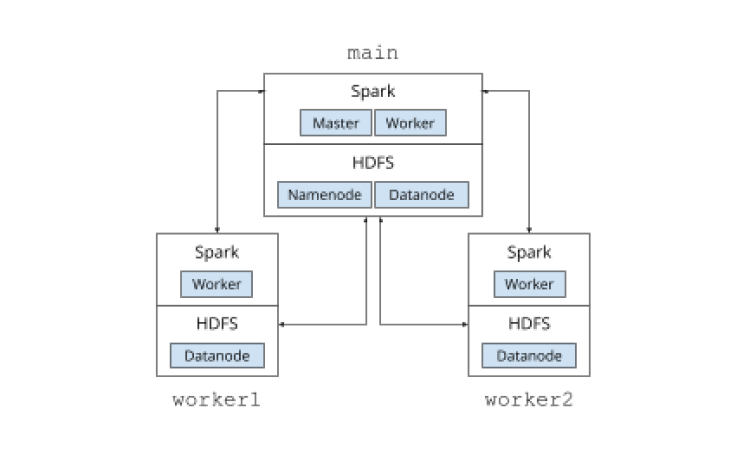
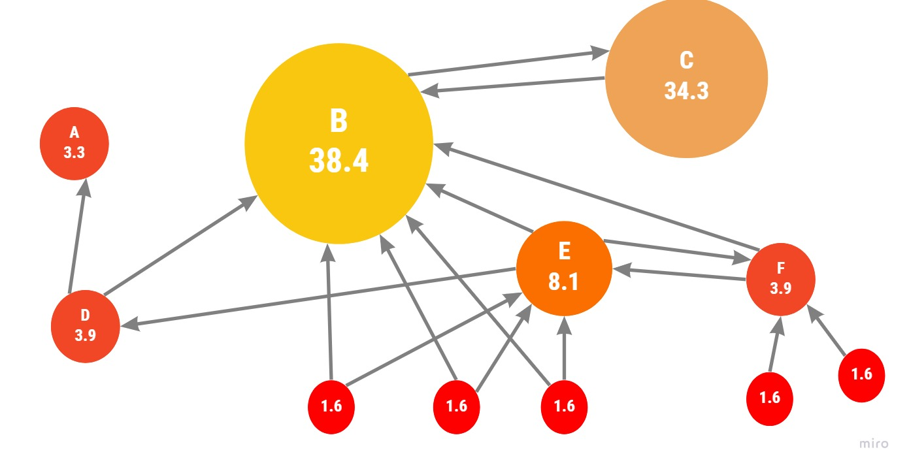

# Computing PageRank on Spark RDD

## Project Overview

This project aims to deploy a Docker-based HDFS/Spark cluster and demonstrate its ability to perform distributed data storage and computation tasks. We will set up a three-node cluster, consisting of a master node and two worker nodes, where HDFS serves as the storage layer and Spark as the computation engine. The project consists of several key tasks, including HDFS setup, Spark deployment, and implementing specific benchmarks and PageRank computation.



## Setup Instructions

### Prerequisites

Before proceeding, ensure the following software is installed:

- **Docker**: Follow instructions at [Docker’s official website](https://www.docker.com/get-started).
- **Git**: Required for cloning the repository and managing version control.
- **Bash Shell**: Available on most Unix-like systems (Linux, macOS).

### Steps to Run the Project

1. **Clone the Repository**:
   ```bash
   git clone https://github.com/<yourusername>/cs511p1.git
   cd cs511p1
   ```

2. **Start the Cluster**:
   In terminal A, start the Docker cluster:
   ```bash
   bash start-all.sh
   ```

3. **Verify Cluster Status**:
   After the cluster starts, use the following command to check if all nodes are properly connected:
   ```bash
   docker-compose -f cs511p1-compose.yaml exec main hdfs dfsadmin -report
   ```

4. **Run Tests**:
   After verifying the cluster, run the provided test scripts:
   ```bash
   bash test-all.sh
   ```

## Tasks Overview

### Part 1: HDFS - Scaling Out Storage

In this part, we configure the Hadoop Distributed File System (HDFS) across three nodes. After setting up, we verify that HDFS reports 3 live DataNodes and performs basic file read/write operations. The TeraSort benchmark is also implemented to demonstrate HDFS performance under heavy load.

### Part 2: Spark - Speeding Up Computation

Spark is deployed on top of the HDFS cluster, allowing distributed data processing. This part includes setting up Spark, verifying the connection between executors, and running computation benchmarks like Pi estimation and TeraSort. Spark also reads data from HDFS and processes it within the cluster.

### Part 3: HDFS/Spark Sorting

In this part, we process a large dataset of cap serial numbers, filtering out invalid entries and sorting the remaining dataset. This demonstrates both HDFS storage capabilities and Spark’s computational efficiency.

### Part 4: HDFS/Spark PageRank

This task involves implementing the **PageRank algorithm** to compute the importance of nodes in a network based on their connections. The network dataset is represented as a CSV file where each line denotes a link between two nodes.
See [PageRank Algorithm](https://en.wikipedia.org/wiki/PageRank).
#### PageRank Overview
- The PageRank algorithm is a powerful tool for ranking nodes in a graph, widely used in search engines to rank websites based on their link structure.
- We optimized memory usage and performance by tuning Spark configurations and using efficient data structures in the PageRank computation.


#### Steps to Implement PageRank:
1. **Input Dataset**: The dataset is imported into HDFS, which stores the connections between nodes as edges in a graph.
2. **Algorithm**: We implement the PageRank algorithm in Spark using the following key parameters:
   - **Damping factor (d)**: Set to 0.85, this parameter prevents sinks in the graph from monopolizing the ranking.
   - **Tolerance (ε)**: Set to 0.0001, to determine when the algorithm should stop iterating.
3. **Output**: After computation, the PageRank value for each node is written to a CSV file. Results are sorted in descending order based on PageRank values, with ties broken by ascending node ID.


## Resources

- [Apache Hadoop Documentation](https://hadoop.apache.org/docs/)
- [Apache Spark Documentation](https://spark.apache.org/docs/)
